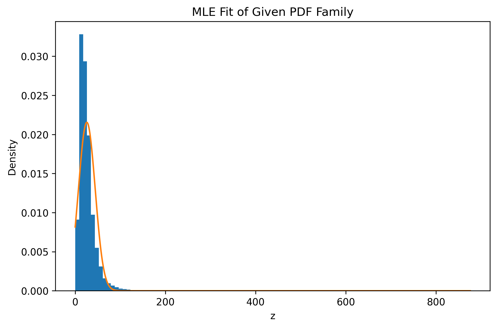

# PDF Estimation using Maximum Likelihood Estimation (MLE)

## Dataset

This project uses the **India Air Quality Data** dataset from Kaggle:

[https://www.kaggle.com/datasets/shrutibhargava94/india-air-quality-data](https://www.kaggle.com/datasets/shrutibhargava94/india-air-quality-data)

The feature used in this project is:

```
no2
```

Total samples used after cleaning: **419,509**

---

# Objective

We were given a parametric probability density family of the form:

[
p(z) = c ; e^{-\lambda (z - \mu)^2}
]

Our goal was:

* Transform the feature `no2` into a new variable `z`
* Estimate optimal parameters ( \mu ), ( \lambda ), and ( c )
* Use **Maximum Likelihood Estimation (MLE)**
* Visualize the fitted model against empirical data

---

# Step 1 — Data Cleaning

* Loaded CSV with proper encoding (`cp1252`)
* Removed missing values
* Converted values to numeric
* Extracted `no2` as NumPy array

---

# Step 2 — Feature Transformation

We applied a nonlinear transformation:

[
z = x + a_r \sin(b_r x)
]

where

[
a_r = 0.05 (r \bmod 7)
]

[
b_r = 0.3 (r \bmod 5 + 1)
]

For roll number:

```
102303592
```

We obtained:

* ( a_r = 0.3 )
* ( b_r = 0.9 )

---

# Step 3 — Model Family and Mathematical Constraint

Given:

[
p(z) = c e^{-\lambda (z-\mu)^2}
]

For this to be a valid probability density function, it must satisfy:

[
\int_{-\infty}^{\infty} p(z) , dz = 1
]

We know:

[
\int_{-\infty}^{\infty} e^{-\lambda (z-\mu)^2} dz = \sqrt{\frac{\pi}{\lambda}}
]

So normalization gives:

[
c \sqrt{\frac{\pi}{\lambda}} = 1
]

Therefore:

[
c = \sqrt{\frac{\lambda}{\pi}}
]

This means **c is not independent**.

The model reduces to two parameters:

[
p(z; \mu, \lambda) = \sqrt{\frac{\lambda}{\pi}} , e^{-\lambda (z-\mu)^2}
]

---

# Step 4 — Maximum Likelihood Estimation

Given samples ( z_1, z_2, ..., z_n ), the likelihood is:

[
L(\mu,\lambda) = \prod_{i=1}^{n} p(z_i; \mu, \lambda)
]

We maximize the log-likelihood:

[
\ell(\mu,\lambda) = \sum_{i=1}^{n} \log p(z_i)
]

After substitution and simplification:

[
\ell(\mu,\lambda) =
\frac{n}{2} \log \lambda

* \frac{n}{2} \log \pi
* \lambda \sum (z_i - \mu)^2
  ]

Setting derivatives to zero gives:

[
\mu = \text{sample mean}
]

[
\lambda = \frac{1}{2 ; \text{variance}}
]

So MLE gives closed-form optimal parameters.

We verified this numerically using L-BFGS-B optimization, and the optimizer converged to the same values.

---

# Final Estimated Parameters

```
mu     = 25.801325453003013
lambda = 0.0014587890131696967
c      = 0.021548711440552787
```

Final learned model:

[
p(z) = 0.0215487 ; e^{-0.00145879 (z - 25.8013)^2}
]

---

# Model Normalization Check

We numerically verified:

[
\int_{\mu - 6\sigma}^{\mu + 6\sigma} p(z) dz \approx 1
]

Result:

```
0.999999998
```

So the model is properly normalized.

---

# Model Fit Visualization

Below is the fitted PDF compared to the empirical histogram of transformed data:



Observation:

* The model captures the central tendency.
* However, due to skewness and heavy tails in air quality data, the symmetric model cannot perfectly match the distribution.
* Within this model family, these parameters are optimal.

---

# Key Takeaways

* We used raw data directly (no histogram fitting).
* Parameters were estimated using Maximum Likelihood Estimation.
* The normalization constant ( c ) was derived analytically as a function of ( \lambda ).
* Numerical optimization confirmed the closed-form MLE solution.
* The final model is the best possible fit within the given functional family.

---

# Project Structure

```
PDF-Estimator/
│
├── DATA/
│   └── data.csv
│
├── images/
│   └── hist_fit.png
│
├── notebooks/
│   └── main.ipynb
└── README.md
```

---

# Conclusion

Even though the transformed data is not perfectly symmetric, Maximum Likelihood Estimation guarantees that the estimated parameters are the optimal fit within the specified exponential quadratic family.

This project demonstrates:

* Statistical modeling
* Analytical parameter estimation
* Numerical optimization verification
* Probability density normalization
* Visual validation of model fit

---

Built with Python, NumPy, SciPy, and Matplotlib.
